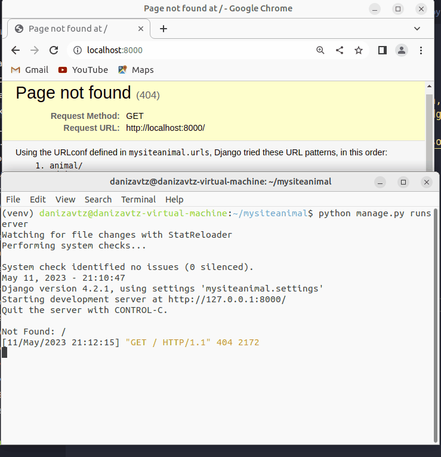

# djangoanimal

Instruções para execução.

Baixar o projeto com o git clone

1. criar o ambiente virtual (use o seu método favorito, eu uso o virtualenv) `virtualenv venv -p $(which python3)`
2. ativar o ambiente virtual: `source venv/bin/activate`
3. instalar as dependências do arquivo `pip install -r requirements.txt`
4. Checkar migrations: `python manage.py makemigrations`
5. Aplicar as migrations: `python manage.py migrate`

## Rodar o django shell

Para facilitar a execução eu abri o django shell e fiz o cadastro na mão de 3 animais.

Segue o código que deve ser utilizado:

    python manage.py shell
    a = Animal(nome='a',descricao='a',genero='a',especie='gato')
    a.save()
    b = Animal(nome='b',descricao='b',genero='b',especie='cachorro')
    b.save()
    c = Animal(nome='c',descricao='c',genero='c',especie='capivara')
    c.save()

Após cumprir esses passos agora será possível executar a aplicação para testar o funcionamento.

## Executar o django

    python manage.py runserver

Abaixo você pode ver um exemplo da execução
